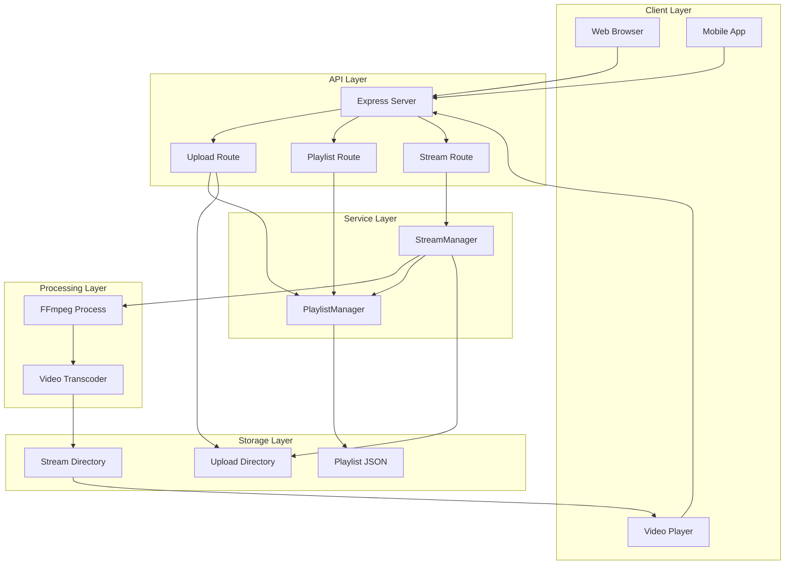
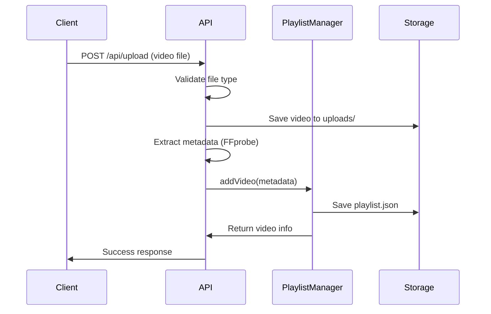
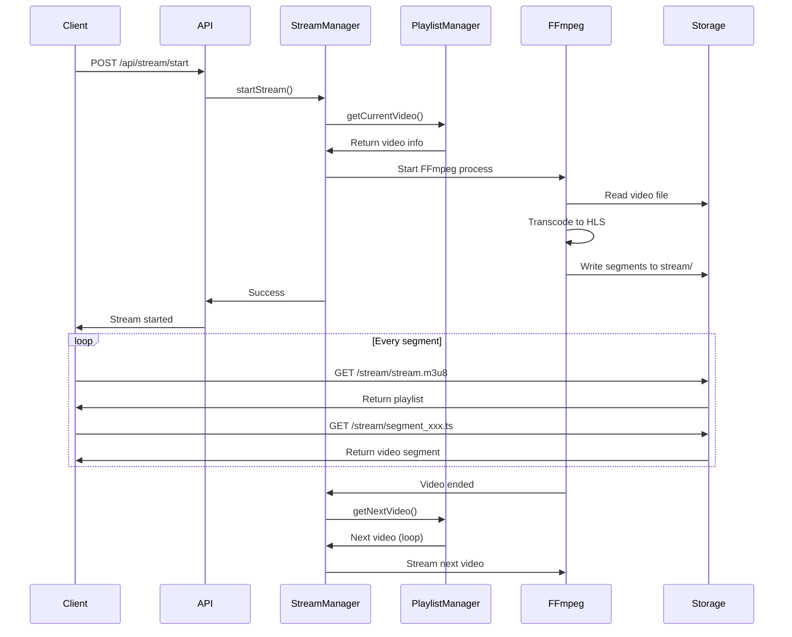

# Insta-Stream Architecture

## System Overview

Insta-Stream is a live streaming server that enables continuous video streaming in HLS format with playlist management capabilities.

## Architecture Diagram



## Component Breakdown

### 1. API Layer

#### Express Server (`src/index.js`)
- Main application entry point
- Configures middleware (CORS, JSON parsing)
- Mounts route handlers
- Serves static HLS files
- Health check endpoint

#### Routes

**Upload Route** (`src/routes/upload.js`)
- Handles video file uploads
- Validates file types
- Extracts video metadata
- Adds videos to playlist

**Playlist Route** (`src/routes/playlist.js`)
- Get playlist status
- Remove videos
- Reorder playlist
- Clear playlist
- Set current video

**Stream Route** (`src/routes/stream.js`)
- Start/stop streaming
- Pause/resume streaming
- Get stream status

### 2. Service Layer

#### PlaylistManager (`src/services/PlaylistManager.js`)
Manages the video playlist state and persistence.

**Responsibilities:**
- Store playlist in JSON format
- Track current video index
- Handle video addition/removal
- Manage playback state
- Loop playlist automatically

**Key Methods:**
- `addVideo()` - Add video to playlist
- `removeVideo()` - Remove video by ID
- `getCurrentVideo()` - Get currently playing video
- `getNextVideo()` - Advance to next video (with loop)
- `reorderPlaylist()` - Change video order
- `getStatus()` - Get complete playlist state

#### StreamManager (`src/services/StreamManager.js`)
Handles video streaming using FFmpeg.

**Responsibilities:**
- Start/stop FFmpeg process
- Convert videos to HLS format
- Generate HLS segments
- Handle video transitions
- Manage stream loop

**Key Methods:**
- `startStream()` - Initialize streaming
- `streamVideo()` - Stream a specific video
- `stopStream()` - Stop streaming
- `pauseStream()` - Pause playback
- `resumeStream()` - Resume playback
- `getStreamStatus()` - Get stream state

### 3. Processing Layer

#### FFmpeg Integration
FFmpeg is used for video transcoding and HLS generation.

**Process:**
1. Read video file
2. Transcode to H.264 video + AAC audio
3. Segment into HLS chunks (2-10 seconds)
4. Generate m3u8 playlist
5. Stream segments continuously

**FFmpeg Options:**
```bash
-c:v libx264          # H.264 video codec
-preset veryfast      # Fast encoding
-tune zerolatency     # Low latency
-c:a aac              # AAC audio codec
-b:a 128k             # Audio bitrate
-f hls                # HLS format
-hls_time 2           # Segment duration
-hls_list_size 10     # Playlist size
-hls_flags delete_segments+append_list  # Cleanup old segments
```

### 4. Storage Layer

#### Directory Structure
```
insta-stream/
├── uploads/          # Uploaded video files
│   ├── video1.mp4
│   ├── video2.mp4
│   └── playlist.json # Playlist metadata
└── stream/           # HLS output
    ├── stream.m3u8   # Master playlist
    ├── segment_000.ts
    ├── segment_001.ts
    └── segment_002.ts
```

#### Playlist JSON Format
```json
[
  {
    "id": "uuid-v4",
    "filename": "unique-filename.mp4",
    "originalName": "my-video.mp4",
    "path": "/absolute/path/to/video.mp4",
    "size": 10485760,
    "duration": 120.5,
    "addedAt": "2024-01-15T10:30:00.000Z"
  }
]
```

## Data Flow

### Upload Flow


### Streaming Flow


## Key Features Implementation

### 1. Continuous Streaming (Twitch-style)

Uses FFmpeg concat protocol with infinite loop:
```javascript
ffmpeg()
  .input(concatFile)
  .inputOptions([
    '-f concat',
    '-safe 0',
    '-stream_loop -1',  // Infinite loop
    '-re'               // Real-time streaming
  ])
```

### 2. Automatic Loop

When video ends, StreamManager automatically loads next video:
```javascript
.on('end', () => {
  if (playlistManager.isPlaying) {
    this.moveToNextVideo();  // Loops back to start
  }
})
```

### 3. HLS Streaming

Generates browser-compatible HLS segments:
- Compatible with HTML5 video + hls.js
- Works on iOS Safari natively
- Low latency (2-second segments)
- Automatic quality adaptation

### 4. Playlist Management

JSON-based playlist with full CRUD operations:
- Add videos via upload
- Remove videos by ID
- Reorder with drag-and-drop support
- Clear entire playlist
- Jump to specific video

## Scalability Considerations

### Current Limitations
- Single FFmpeg process (one stream)
- File-based storage (not cloud)
- In-memory state (no database)
- Single server instance

### Future Enhancements
1. **Multiple Streams**: Support multiple concurrent streams
2. **Database**: PostgreSQL for playlist persistence
3. **Cloud Storage**: S3 for video storage
4. **Load Balancing**: Multiple server instances
5. **Adaptive Bitrate**: Multiple quality levels
6. **CDN Integration**: CloudFront for global distribution
7. **WebSocket**: Real-time status updates
8. **Authentication**: User accounts and access control

## Performance Optimization

### Current Optimizations
- `veryfast` preset for encoding speed
- `delete_segments` to cleanup old files
- Low latency tuning
- Efficient playlist updates

### Monitoring
- Console logging with timestamps
- FFmpeg progress tracking
- Error handling and recovery
- Automatic stream restart on failure

## Security Considerations

### Current Implementation
- File type validation
- File size limits
- CORS enabled
- No authentication (development only)

### Production Requirements
- Add authentication (JWT tokens)
- Rate limiting
- Input sanitization
- HTTPS only
- File scanning (virus check)
- Access control lists

## Technology Stack

- **Runtime**: Node.js (v16+)
- **Framework**: Express.js
- **Video Processing**: FFmpeg
- **File Upload**: Multer
- **Streaming Protocol**: HLS (HTTP Live Streaming)
- **Video Codec**: H.264
- **Audio Codec**: AAC
- **Container**: MPEG-TS segments

## Development vs Production

### Development
- File-based storage
- No authentication
- Console logging
- No HTTPS
- Single instance

### Production
- Cloud storage (S3)
- JWT authentication
- Centralized logging (CloudWatch)
- HTTPS with certificates
- Load balanced instances
- Database for persistence
- CDN for delivery
