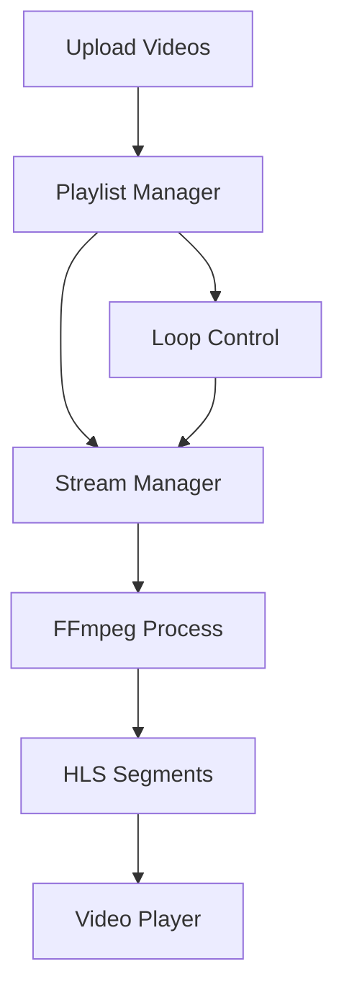

# Insta-Stream Server

A robust live streaming server that allows you to upload videos, manage a playlist, and stream content continuously in HLS format - similar to Twitch-style live streaming.

## Features

- **Video Upload**: Upload videos via REST API
- **Playlist Management**: Add, remove, reorder videos in playlist
- **Continuous Streaming**: Stream videos in loop, HLS format
- **Playback Control**: Start, stop, pause, resume streaming
- **Browser Compatible**: Watch streams directly in browser using HLS
- **Auto Loop**: Automatically loops back to first video after playlist ends

## Prerequisites

- Node.js (v16 or higher)
- FFmpeg installed on your system

### Install FFmpeg

**Ubuntu/Debian:**
```bash
sudo apt update
sudo apt install ffmpeg
```

**macOS:**
```bash
brew install ffmpeg
```

**Windows:**
Download from [ffmpeg.org](https://ffmpeg.org/download.html)

## Installation

1. Clone the repository:
```bash
git clone <repository-url>
cd insta-stream
```

2. Install dependencies:
```bash
npm install
```

3. Create `.env` file:
```bash
cp .env.example .env
```

4. Edit `.env` with your configuration (optional):
```env
PORT=3000
UPLOAD_DIR=./uploads
STREAM_DIR=./stream
HLS_SEGMENT_DURATION=2
MAX_UPLOAD_SIZE=500
```

## Usage

### Start the server

**Development mode:**
```bash
npm run dev
```

**Production mode:**
```bash
npm start
```

The server will start on `http://localhost:3000`

## API Endpoints

### Upload Video
```bash
POST /api/upload
Content-Type: multipart/form-data

# Example with curl
curl -X POST http://localhost:3000/api/upload \
  -F "video=@/path/to/video.mp4"
```

### Get Playlist
```bash
GET /api/playlist

# Response
{
  "success": true,
  "data": {
    "isPlaying": false,
    "currentIndex": 0,
    "totalVideos": 2,
    "currentVideo": { ... },
    "playlist": [ ... ]
  }
}
```

### Start Streaming
```bash
POST /api/stream/start

# Response
{
  "success": true,
  "message": "Stream started",
  "data": {
    "isStreaming": true,
    "streamUrl": "/stream/stream.m3u8",
    ...
  }
}
```

### Stop Streaming
```bash
POST /api/stream/stop
```

### Pause/Resume Streaming
```bash
POST /api/stream/pause
POST /api/stream/resume
```

### Get Stream Status
```bash
GET /api/stream/status
```

### Remove Video from Playlist
```bash
DELETE /api/playlist/:videoId
```

### Reorder Playlist
```bash
POST /api/playlist/reorder
Content-Type: application/json

{
  "order": ["video-id-1", "video-id-2", "video-id-3"]
}
```

### Clear Playlist
```bash
DELETE /api/playlist
```

### Set Current Video
```bash
POST /api/playlist/current/:index
```

## Watch the Stream

### In Browser (HTML5 Video Player)

Create an HTML file or use this example:

```html
<!DOCTYPE html>
<html>
<head>
  <title>Insta-Stream Player</title>
  <script src="https://cdn.jsdelivr.net/npm/hls.js@latest"></script>
</head>
<body>
  <video id="video" controls style="width: 100%; max-width: 800px;"></video>
  
  <script>
    const video = document.getElementById('video');
    const streamUrl = 'http://localhost:3000/stream/stream.m3u8';
    
    if (Hls.isSupported()) {
      const hls = new Hls();
      hls.loadSource(streamUrl);
      hls.attachMedia(video);
      hls.on(Hls.Events.MANIFEST_PARSED, () => {
        video.play();
      });
    } else if (video.canPlayType('application/vnd.apple.mpegurl')) {
      // Safari native HLS support
      video.src = streamUrl;
      video.addEventListener('loadedmetadata', () => {
        video.play();
      });
    }
  </script>
</body>
</html>
```

### Using VLC or Other Players

Open the stream URL in VLC or any HLS-compatible player:
```
http://localhost:3000/stream/stream.m3u8
```

## Architecture



## How It Works

1. **Upload**: Videos are uploaded via multipart form data to `/api/upload`
2. **Playlist**: Videos are stored in a JSON playlist with metadata
3. **Streaming**: FFmpeg converts videos to HLS format with segments
4. **Loop**: When the last video finishes, it automatically starts from the first
5. **Continuous**: Stream runs continuously like Twitch, using concat protocol
6. **Playback**: Clients can watch using any HLS-compatible player

## Project Structure

```
insta-stream/
├── src/
│   ├── config.js                 # Configuration management
│   ├── index.js                  # Express server
│   ├── middleware/
│   │   └── upload.js            # Multer upload middleware
│   ├── routes/
│   │   ├── upload.js            # Upload endpoints
│   │   ├── playlist.js          # Playlist endpoints
│   │   └── stream.js            # Stream control endpoints
│   ├── services/
│   │   ├── PlaylistManager.js   # Playlist logic
│   │   └── StreamManager.js     # FFmpeg streaming logic
│   └── utils/
│       └── logger.js            # Logging utility
├── uploads/                      # Uploaded videos
├── stream/                       # HLS segments and playlist
├── .env.example
├── .gitignore
├── package.json
└── README.md
```

## Troubleshooting

### FFmpeg not found
Make sure FFmpeg is installed and in your system PATH:
```bash
ffmpeg -version
```

### Stream not playing
- Check if stream is started: `GET /api/stream/status`
- Verify playlist has videos: `GET /api/playlist`
- Check stream directory has `.m3u8` and `.ts` files
- Try accessing `http://localhost:3000/stream/stream.m3u8` directly

### Upload fails
- Check file size limit in `.env` (MAX_UPLOAD_SIZE)
- Verify upload directory has write permissions
- Ensure video format is supported (mp4, mpeg, mov, avi, mkv, webm)

## License

MIT

## Contributing

Pull requests are welcome! For major changes, please open an issue first.
